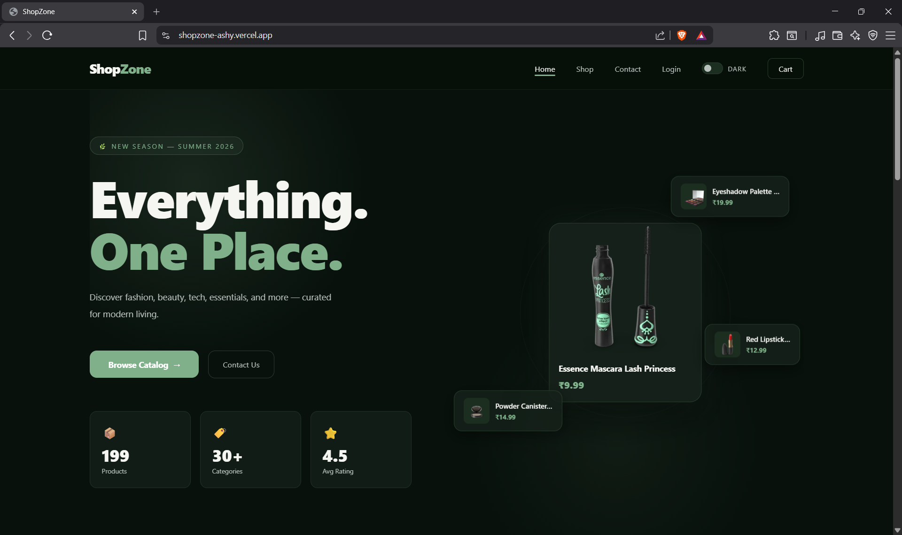
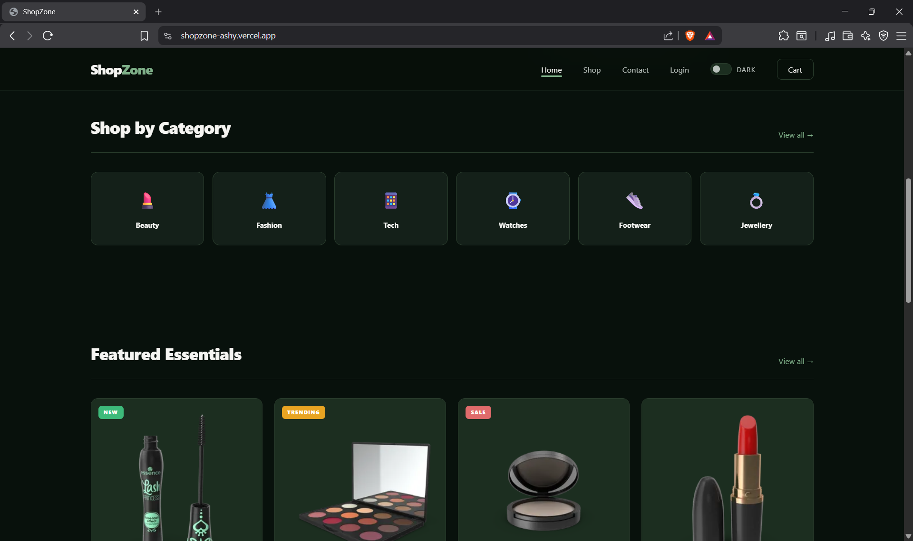
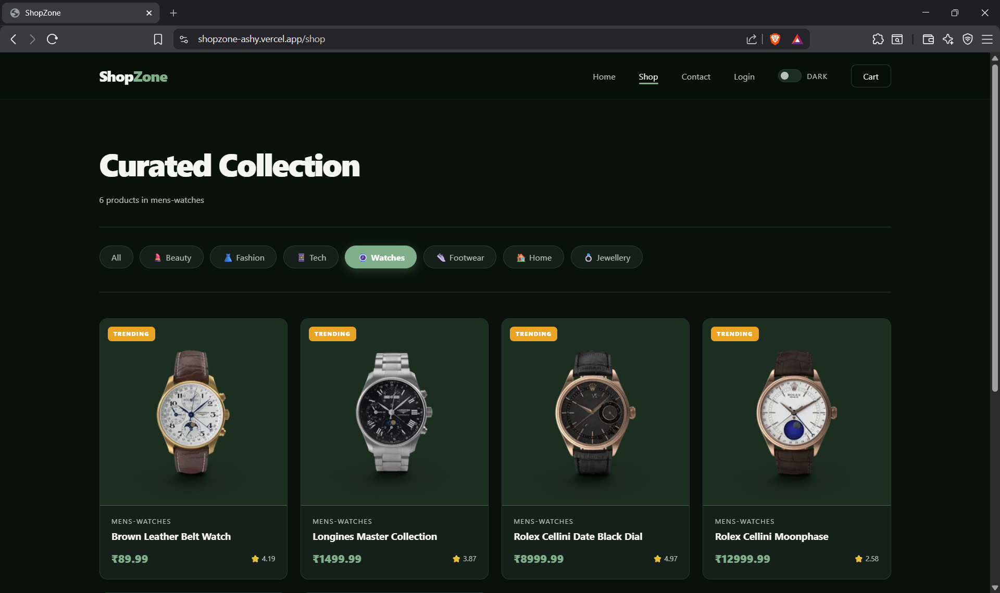
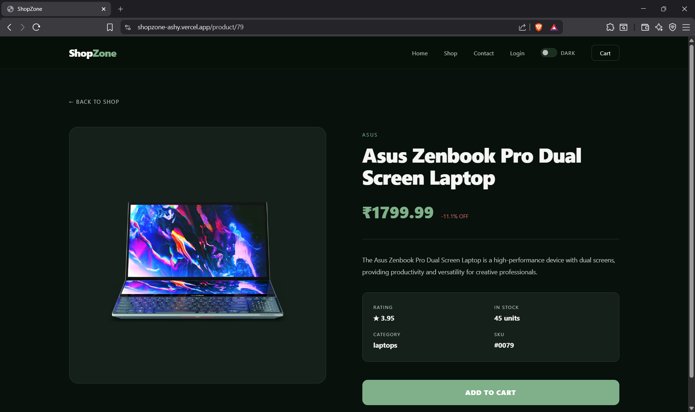
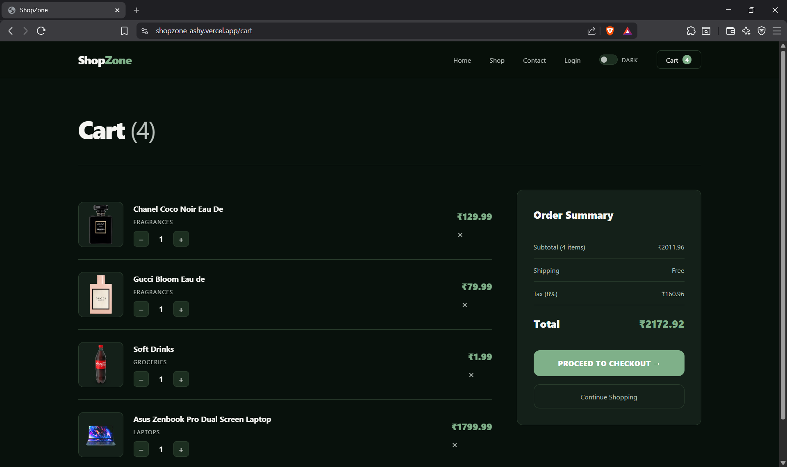
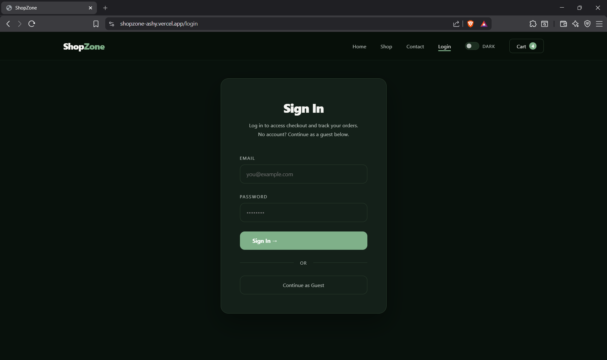
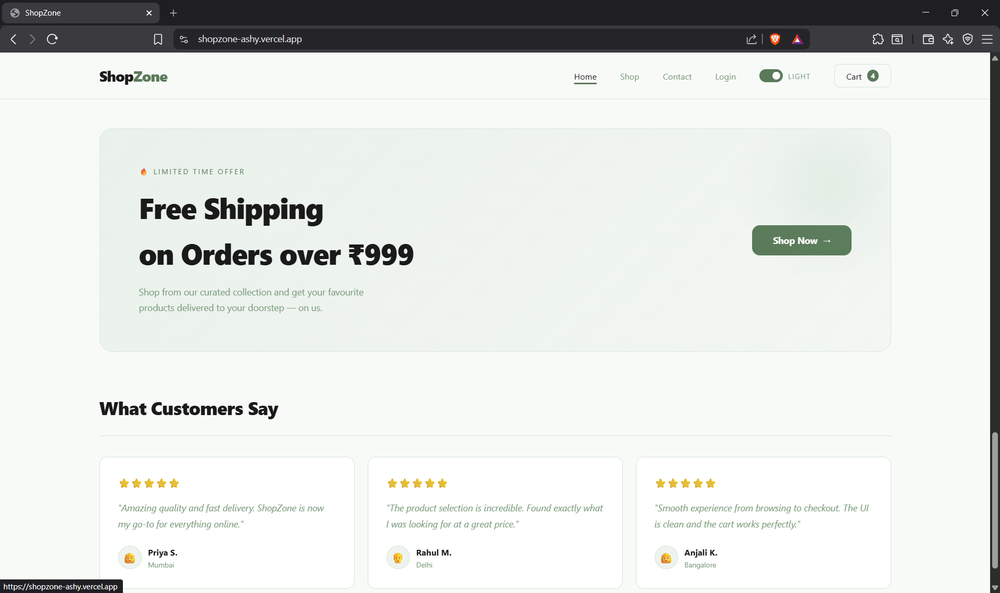

# ShopZone
> A modern, fully responsive E-Commerce Single Page Application built with React, Vite, and React Router v6. Features global cart state, mock authentication, protected routes, dark/light theme toggle, and a premium forest-green design aesthetic.



---

## 🔗 Links

| | |
|---|---|
| 🌐 **Live Demo** | [shopzone-ashy.vercel.app](https://shopzone-ashy.vercel.app) |
| 📁 **Repository** | [github.com/ashish-bisht-iot/shopzone](https://github.com/ashish-bisht-iot/shopzone) |
---

## 📸 Screenshots

### Home Page


### Shop — Product Grid with Filters


### Product Detail


### Cart


### Login & Guest Auth


### Light Mode


---

## ✨ Features

### Core (Sprint Requirements)
- ✅ **Client-side routing** — URL changes without any page reload
- ✅ **Dynamic routes** — `/product/:id` via `useParams()` hook
- ✅ **Global cart state** — `CartContext` + `useReducer`, no Redux
- ✅ **Live cart badge** — updates instantly across all routes
- ✅ **Duplicate prevention** — re-adding an item increments quantity
- ✅ **localStorage persistence** — cart survives hard browser refresh
- ✅ **Mock authentication** — email/password or guest login
- ✅ **Protected route** — `/checkout` redirects to `/login` if not authenticated
- ✅ **Quantity controls** — increment, decrement, remove items
- ✅ **Order summary** — subtotal, shipping, tax, and total calculation

### UI & Design
- 🌙 **Dark / Light theme toggle** — forest green dark mode, soft white light mode
- 🎨 **Premium aesthetic** — deep forest green palette, cream text, soft glow effects
- 💫 **Animations** — floating hero cards, fade-in sections, hover lift effects
- 🏷️ **Product badges** — NEW, TRENDING, SALE, LIMITED
- ❤️ **Wishlist** — toggle heart on product cards
- ⚡ **Quick Add** — add to cart directly from product grid
- 🔍 **Category filters** — filter by Beauty, Fashion, Tech, Watches, Footwear, Jewellery
- 📱 **Responsive** — works on mobile, tablet, and desktop

---

## 🛠️ Tech Stack

| Technology | Purpose |
|---|---|
| React 18 | UI library |
| Vite | Build tool & dev server |
| React Router DOM v6 | Client-side routing |
| Context API + useReducer | Global state management |
| localStorage | Cart & auth persistence |
| DummyJSON API | Product data source |
| CSS Variables | Theming system |

---

## 📁 Project Structure

```
shopzone/
├── public/
├── src/
│   ├── context/
│   │   └── CartContext.jsx       # Global cart + auth state
│   ├── components/
│   │   ├── Navbar.jsx            # Persistent nav with cart badge + theme toggle
│   │   └── ProtectedRoute.jsx    # Redirects unauthenticated users
│   ├── pages/
│   │   ├── Home.jsx              # Hero, categories, featured, testimonials
│   │   ├── Shop.jsx              # Product grid with category filters
│   │   ├── ProductDetail.jsx     # Single product view with add to cart
│   │   ├── Cart.jsx              # Cart items, qty controls, order summary
│   │   ├── Contact.jsx           # Static contact form
│   │   ├── Login.jsx             # Mock auth with guest login
│   │   └── Checkout.jsx          # Protected checkout page
│   ├── App.jsx                   # Route configuration
│   ├── main.jsx                  # App entry point
│   └── index.css                 # Global styles + design tokens
├── vercel.json                   # SPA routing fix for Vercel
├── Prompts.md                    # AI debugging log
└── README.md
```

---

## 🗺️ Routes

| Path | Page | Protected |
|---|---|---|
| `/` | Home | No |
| `/shop` | Product catalog | No |
| `/product/:id` | Product detail | No |
| `/cart` | Shopping cart | No |
| `/contact` | Contact form | No |
| `/login` | Login / Guest auth | No |
| `/checkout` | Checkout | ✅ Yes — redirects to `/login` |

---

## 🚀 Getting Started

### Prerequisites
- Node.js 18+
- npm

### Run Locally

```bash
# Clone the repo
git clone https://github.com/ashish-bisht-iot/shopzone.git
cd shopzone

# Install dependencies
npm install

# Start dev server
npm run dev
```

Open [http://localhost:5173](http://localhost:5173) in your browser.

### Build for Production

```bash
npm run build
```

---

## ☁️ Deployment (Vercel)

The `vercel.json` file at the root handles SPA routing — without it, refreshing any route like `/product/5` returns a 404.

```json
{
  "rewrites": [{ "source": "/(.*)", "destination": "/" }]
}
```

To deploy:

```bash
# Install Vercel CLI
npm i -g vercel

# Deploy
vercel --prod
```

Or connect your GitHub repo directly on [vercel.com](https://vercel.com) for automatic deployments.

---

## 🧠 How It Works

### Client-Side Routing
React Router v6 handles all navigation. The `<BrowserRouter>` wraps the entire app, and `<Routes>` + `<Route>` define the page tree. `<Link>` and `useNavigate()` are used for navigation — never `<a href>` tags, which would trigger a full page reload and clear the cart.

### Global Cart State
`CartContext` uses `useReducer` for predictable state updates. The reducer handles `ADD_TO_CART` (with duplicate check), `UPDATE_QTY`, `REMOVE_FROM_CART`, `CLEAR_CART`, `LOGIN`, and `LOGOUT`. Two `useEffect` hooks sync cart and auth state to `localStorage` on every change.

### Protected Routes
`ProtectedRoute.jsx` reads `isLoggedIn` from `CartContext`. If `false`, it renders `<Navigate to="/login" replace />` — React Router's declarative redirect. If `true`, it renders the child component.

### Theme System
Theme is stored in `localStorage` and applied as a `data-theme` attribute on `<html>`. CSS variables in `:root` define the dark theme, and `[data-theme="light"]` overrides them for light mode. All components automatically adapt with zero JavaScript.

---

## 📝 API

Data sourced from [DummyJSON](https://dummyjson.com) — a free REST API for fake product data.

| Endpoint | Used For |
|---|---|
| `GET /products?limit=100` | Shop page product grid |
| `GET /products?limit=8` | Home page featured products |
| `GET /products/:id` | Product detail page |

---

## 🤖 AI Usage

See [Prompts.md](./Prompts.md) for the full log of AI-assisted debugging sessions during development.

---